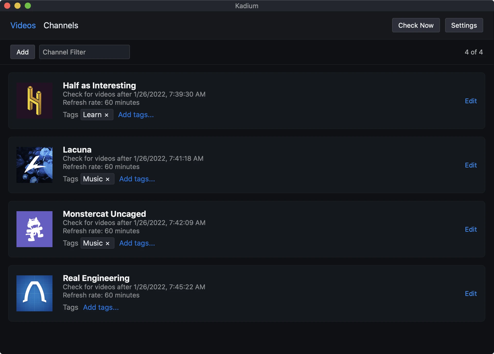

	

<h3 align="center">Kadium</h3>

	App for staying ontop of YouTube channels' uploads
	 
	<a href="https://kadium.kasper.space"><b>Download for Mac, Windows or Linux</b></a>

 

## Dev instructions

### Get started

1. Install Node.js
2. Install Rust
3. Follow the [Tauri setup guide](https://tauri.studio/en/docs/getting-started/intro)
4. Run `npm install`

### Commands

- `npm run dev`: Start app in dev mode. It sets `DEVELOPMENT=1` to tell the app to use `./src-tauri/appdata` for app data.
- `npm run build`: Build
- `npm run lint`: Lint
- `npm run format`: Format

### Release new version
1. Update `CHANGELOG.md`
2. Bump the version number in `src-tauri/Cargo.toml`
3. Run `cargo check` to update `Cargo.lock`
4. Create a git tag in the format `v#.#.#`
5. Add release notes to the generated GitHub release and publish it
