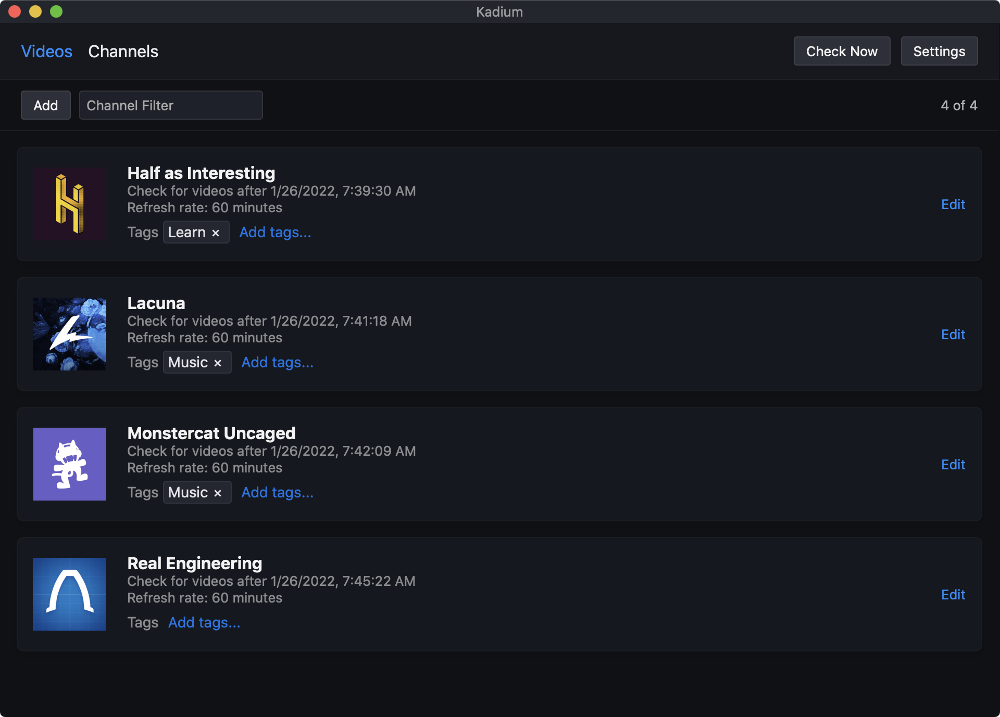

  

<h3 align="center">Kadium</h3>

  App for staying ontop of YouTube channel uploads
   
  <a href="https://github.com/probablykasper/kadium/releases"><b>Download for Mac, Windows or Linux</b></a>

## Dev instructions

### Get started

1. Install Node.js (v14 works)
2. Install Rust (v1.50 works)
3. Follow the [Tauri setup guide](https://tauri.studio/en/docs/getting-started/intro)
4. Run `npm install`

### Commands

- `DEVELOPMENT=1 npm run dev`: Start in dev mode. `DEVELOPMENT=1` tells Kadium to use `./src-tauri/appdata` for app data.
- `npm run build`: Build
- `npm run lint`: Lint
- `npm run check`: Run svelte-check
